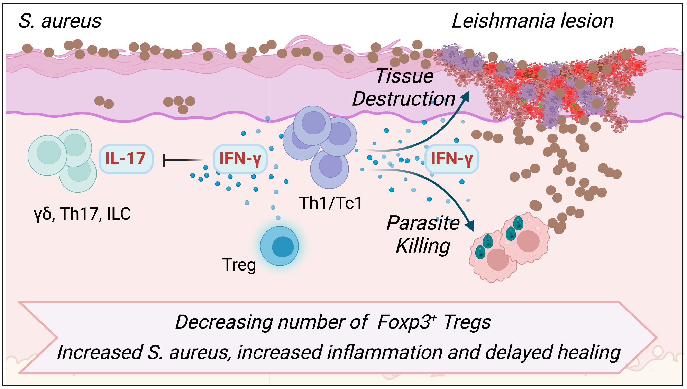

# Code files for FOXP3+ Singh et al. 2023

This is the R code associated with the human sequencing datasets in:

<strong>Foxp3+ regulatory T cells limit Staphylococcus aureus colonization and disease severity of cutaneous leishmaniasis</strong>

<em>Tej Pratap Singh, Camila Farias Amorim, Victoria Lovins, Charles W Bradley, Lucas P. Carvalho, Edgar M. Carvalho, Elizabeth A. Grice, and Phillip Scott</em>

Unpublished, under review manuscript
Feb 2023.

Abstract
Cutaneous leishmaniasis is a parasitic disease causing a wide range of clinical manifestations. The skin microbiota is a factor that affects disease outcome, with high levels of Staphylococcus aureus in lesions from Leishmania braziliensis patients associated with pathologic immune responses and decreased healing. However, it is not known how microbiota-driven immune responses contributing to the disease are regulated in these patients. Here, we investigate the role of Foxp3 regulatory T cells (Tregs) in modulating the immune responses against S. aureus. We found that while S. aureus colonized mice developed an IL-17 response and an accumulation of Tregs, depletion of either Tregs or RORgt expression in Tregs resulted in an IFN-g-dependent increase in skin inflammation and a higher S. aureus burden. Similarly, partial depletion of Tregs in S. aureus colonized mice infected with L. braziliensis led to increased IFN-g, augmented disease severity, and increased S. aureus burdens. Our findings have clinical significance, as transcriptional analysis of lesions from L. braziliensis patients revealed that low FOXP3 expression is associated with higher IFNG and cytolytic gene expression, a higher S. aureus burden, and delayed lesion resolution compared to patients with high FOXP3 expression. Thus, these results suggest an unexpected and critical role for Tregs in limiting opportunistic bacterial skin infection by reducing IFN-g-mediated pathology in cutaneous leishmaniasis.

ADD DOI HERE

